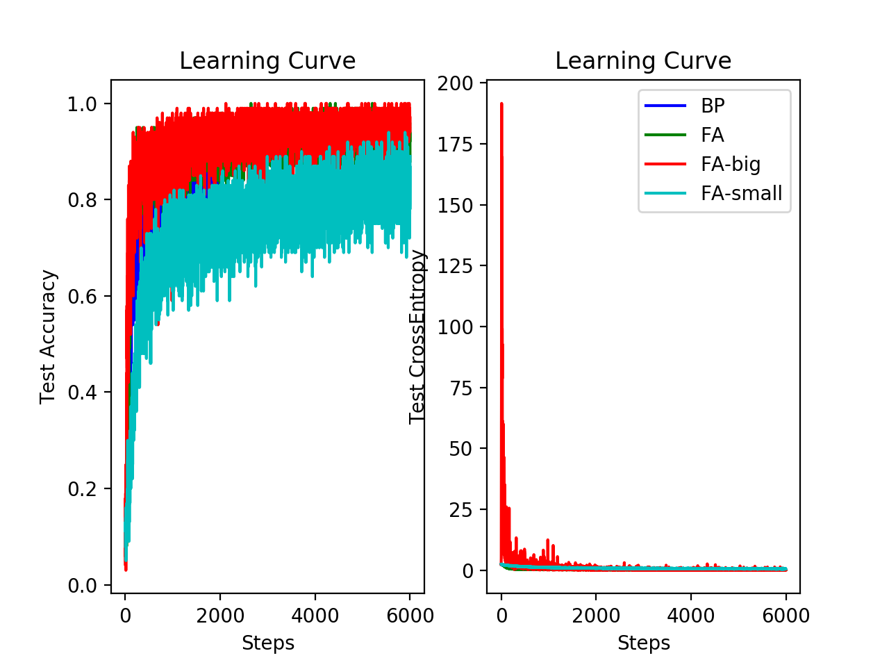
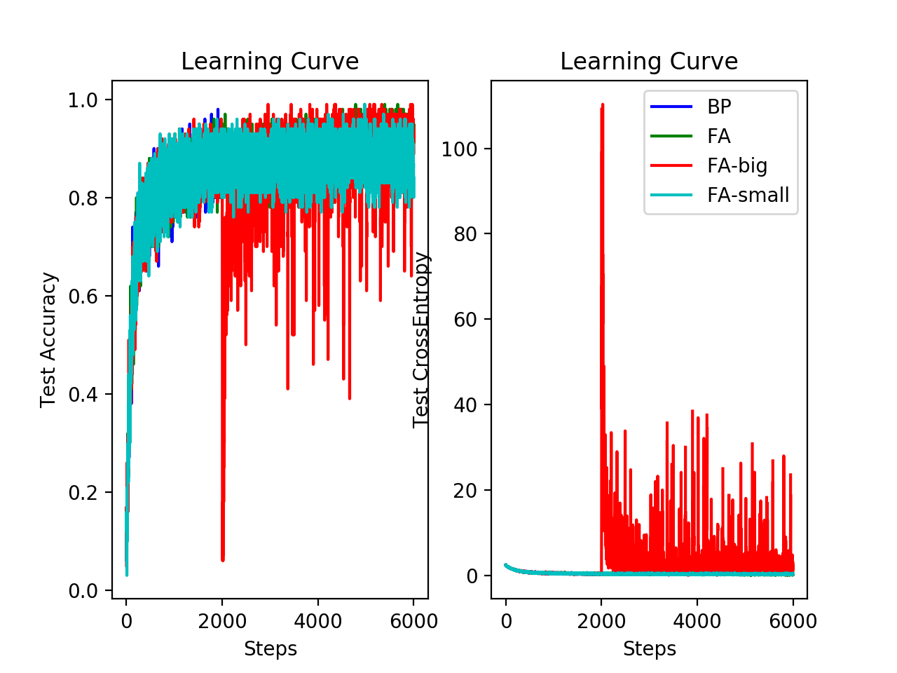
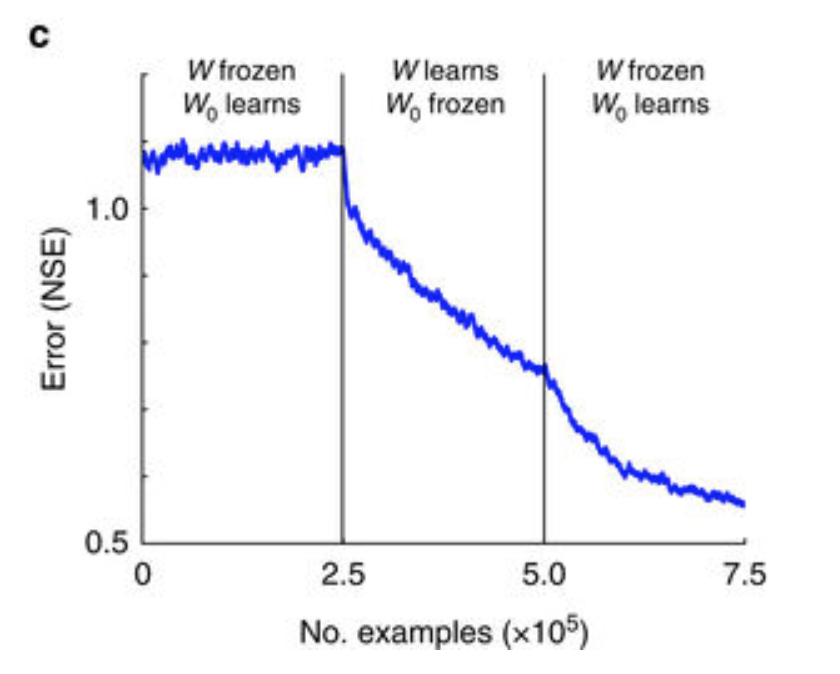

# Feedback-Alignment
Feedback alignment is a backpropagation modification where the next layer weights become a fixed random matrix. [Lillicrap et al](https://www.nature.com/articles/ncomms13276) shows a FA is a regularizer where the next layer weights must learn to orient within 90 degree in order to perform effective training. The main obstacle of FA is to prove of general convergence under nonlinear dynamics.

## Reproduce result

One hidden layer 784-100-10, weights are drawn from normal distribution with std 0.1. fixed update matrix (**B**) has shape 100x10 drawn from normal distribution with std 1. Learning rate is 1e-4, using standard gradient descent method.

B-big is B enlarge 100 times (equivalent to enlarge the learning rate 100 times)
B-small is B shrinks 100 times (equivalent to shrink the learning rate 100 times)

**normal BP/FA**:

**abrupt BP(2000 steps)->FA(4000 steps)**:

**stage learning**:
From paper:

reproduce result:
